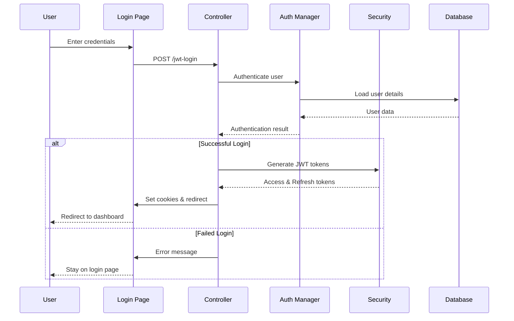
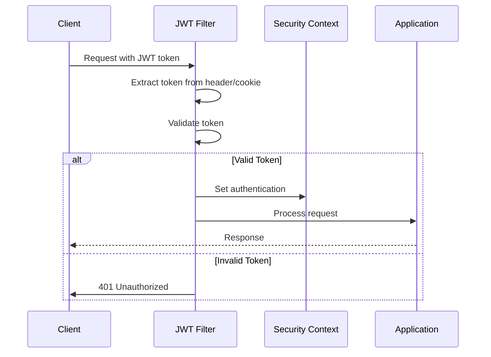
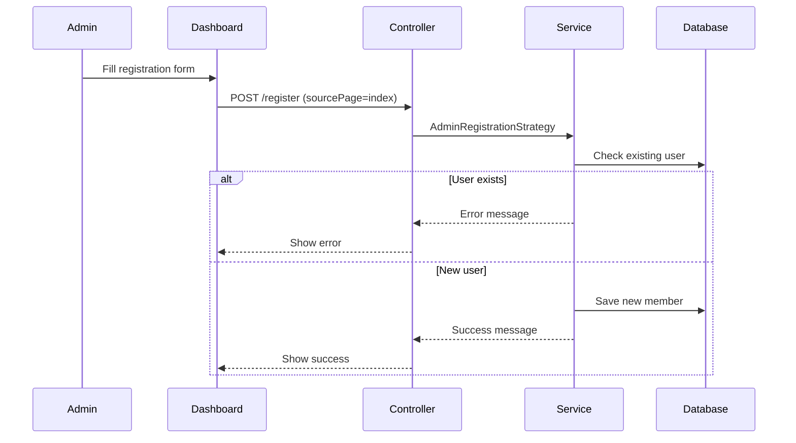
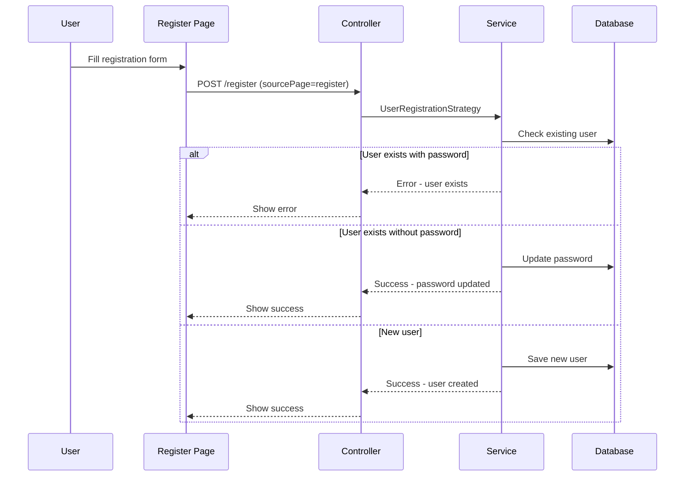
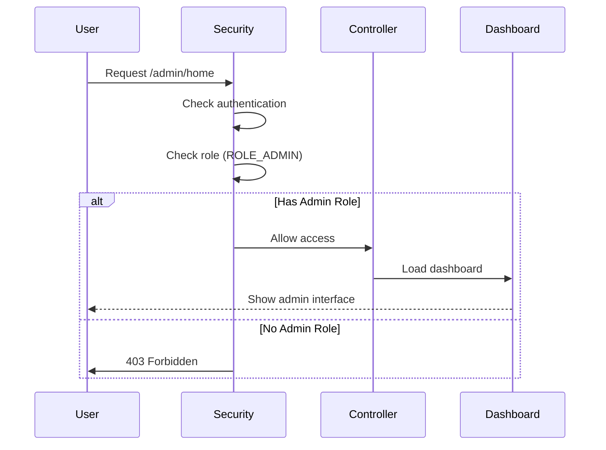
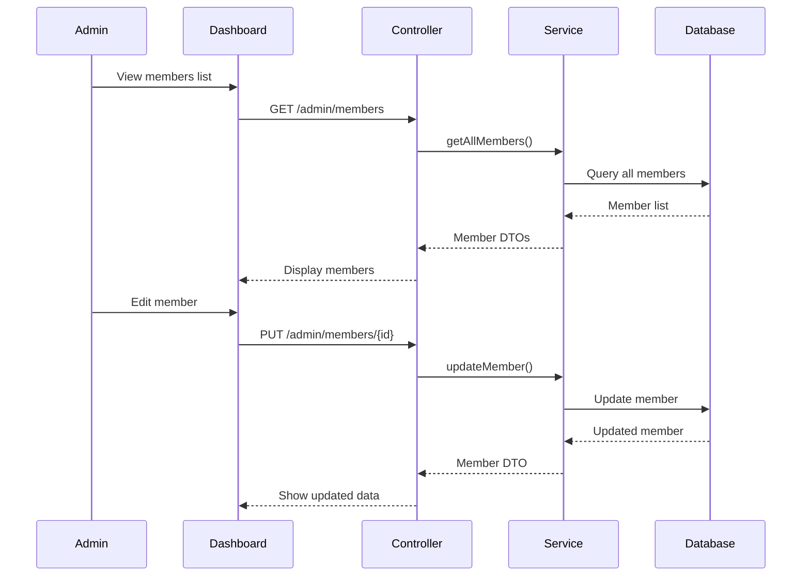
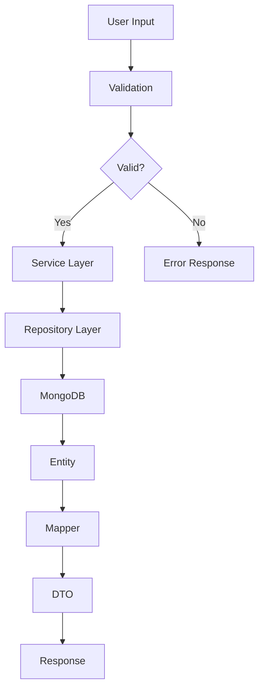
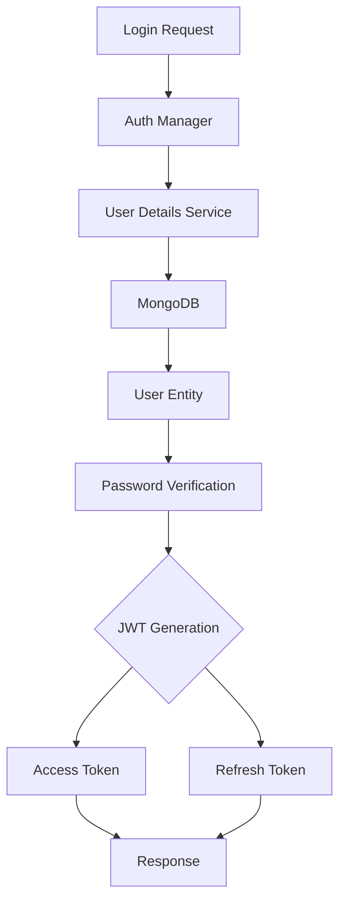

# KitchenSink Application Flow Documentation

## Table of Contents
1. [System Overview](#system-overview)
2. [Architecture](#architecture)
3. [Authentication Flow](#authentication-flow)
4. [User Registration Flow](#user-registration-flow)
5. [Admin Dashboard Flow](#admin-dashboard-flow)
6. [API Endpoints](#api-endpoints)
7. [Security Implementation](#security-implementation)
8. [Data Flow](#data-flow)
9. [Error Handling](#error-handling)

## System Overview

The KitchenSink application is a Spring Boot-based web application that demonstrates a complete authentication and authorization system with JWT tokens, MongoDB persistence, and role-based access control.

### Key Features
- **JWT-based Authentication**: Secure token-based authentication
- **Role-based Authorization**: Admin and User roles with different access levels
- **MongoDB Integration**: NoSQL database for user management
- **RESTful APIs**: Complete CRUD operations for user management
- **Web Interface**: Thymeleaf templates for user interaction
- **Security**: Spring Security with custom filters and handlers

## Architecture

### Technology Stack
- **Backend**: Spring Boot 3.2.5
- **Database**: MongoDB
- **Authentication**: JWT (JSON Web Tokens)
- **Security**: Spring Security
- **Templating**: Thymeleaf
- **Build Tool**: Maven
- **Java Version**: 21

### Component Architecture

```
┌─────────────────┐    ┌─────────────────┐    ┌─────────────────┐
│   Web Layer     │    │  Security Layer │    │  Data Layer     │
│                 │    │                 │    │                 │
│ • Controllers   │◄──►│ • JWT Filters   │◄──►│ • MongoDB       │
│ • Thymeleaf     │    │ • Auth Manager  │    │ • Repositories  │
│ • REST APIs     │    │ • User Details  │    │ • Entities      │
└─────────────────┘    └─────────────────┘    └─────────────────┘
         │                       │                       │
         ▼                       ▼                       ▼
┌─────────────────┐    ┌─────────────────┐    ┌─────────────────┐
│  Service Layer  │    │  Mapper Layer   │    │  Config Layer   │
│                 │    │                 │    │                 │
│ • Auth Service  │◄──►│ • MapStruct     │◄──►│ • Security Config│
│ • Member Service│    │ • DTO Mapping   │    │ • Data Init     │
│ • Business Logic│    │ • Entity Mapping│    │ • Bean Config   │
└─────────────────┘    └─────────────────┘    └─────────────────┘
```

## Authentication Flow

### 1. User Login Process



### 2. JWT Token Flow



## User Registration Flow

### 1. Admin Registration (via Admin Dashboard)



### 2. User Registration (via Registration Page)



## Admin Dashboard Flow

### 1. Admin Access Control



### 2. Member Management



## API Endpoints

### Authentication Endpoints

| Method | Endpoint | Description | Access |
|--------|----------|-------------|--------|
| GET | `/login` | Login page | Public |
| POST | `/jwt-login` | JWT authentication | Public |
| GET | `/jwt-login` | JWT login page | Public |
| POST | `/jwt-signup` | JWT registration | Public |
| POST | `/jwt-logout` | JWT logout | Authenticated |

### REST API Endpoints

| Method | Endpoint | Description | Access |
|--------|----------|-------------|--------|
| GET | `/api/auth/login` | REST login | Public |
| POST | `/api/auth/signup` | REST registration | Public |
| POST | `/api/auth/refresh` | Refresh token | Public |
| POST | `/api/auth/validate` | Validate token | Public |

### Admin Endpoints

| Method | Endpoint | Description | Access |
|--------|----------|-------------|--------|
| GET | `/admin/home` | Admin dashboard | Admin |
| GET | `/admin/members` | List all members | Admin |
| GET | `/admin/members/{id}` | Get member by ID | Admin |
| GET | `/admin/members/search` | Search by email | Admin |
| POST | `/admin/members` | Create member | Admin |
| PUT | `/admin/members/{id}` | Update member | Admin |
| DELETE | `/admin/members/{id}` | Delete member | Admin |

### User Endpoints

| Method | Endpoint | Description | Access |
|--------|----------|-------------|--------|
| GET | `/user-profile` | User profile page | User/Admin |
| POST | `/register` | Registration | Public |

## Security Implementation

### Security Configuration

```java
@Configuration
@EnableWebSecurity
public class SecurityConfig {
    // JWT-based authentication
    // Stateless session management
    // Role-based access control
    // CORS configuration
}
```

### Security Filters

1. **JwtAuthenticationFilter**: Processes JWT tokens from Authorization header
2. **JwtCookieAuthenticationFilter**: Processes JWT tokens from cookies
3. **CustomUserDetailsService**: Loads user details from MongoDB

### Access Control Matrix

| Resource | Anonymous | User | Admin |
|----------|-----------|------|-------|
| `/` | ✅ | ✅ | ✅ |
| `/login` | ✅ | ✅ | ✅ |
| `/register` | ✅ | ✅ | ✅ |
| `/jwt-login` | ✅ | ✅ | ✅ |
| `/jwt-signup` | ✅ | ✅ | ✅ |
| `/user-profile` | ❌ | ✅ | ✅ |
| `/admin/**` | ❌ | ❌ | ✅ |
| `/api/auth/**` | ✅ | ✅ | ✅ |

## Data Flow

### 1. User Data Flow



### 2. Authentication Data Flow



## Error Handling

### Global Exception Handler

```java
@ControllerAdvice
public class GlobalExceptionHandler {
    // ResourceNotFoundException: 404
    // ValidationException: 400
    // GeneralException: 500
}
```

### Error Response Format

```json
{
    "timestamp": "2025-07-31T09:30:00",
    "message": "Error description",
    "details": "Detailed error information",
    "validationErrors": {
        "field": "error message"
    }
}
```

### Common Error Scenarios

1. **Authentication Failures**
   - Invalid credentials: 401 Unauthorized
   - Expired token: 401 Unauthorized
   - Invalid token: 401 Unauthorized

2. **Authorization Failures**
   - Insufficient privileges: 403 Forbidden
   - Missing role: 403 Forbidden

3. **Validation Failures**
   - Invalid input data: 400 Bad Request
   - Missing required fields: 400 Bad Request

4. **Resource Errors**
   - User not found: 404 Not Found
   - Member not found: 404 Not Found

## Database Schema

### MemberDocument Collection

```json
{
    "_id": "ObjectId",
    "name": "String (required, max 25 chars)",
    "email": "String (unique, required)",
    "phoneNumber": "String (required, 10-12 digits)",
    "password": "String (encrypted)",
    "role": "String (ROLE_ADMIN or ROLE_USER)"
}
```

### Default Users

| Email | Password | Role | Description |
|-------|----------|------|-------------|
| admin@admin.com | admin123 | ROLE_ADMIN | Default admin user |
| user@user.com | user123 | ROLE_USER | Default regular user |

## Configuration Files

### Application Properties

```yaml
# Server Configuration
server:
  port: 8080

# MongoDB Configuration
spring:
  data:
    mongodb:
      uri: mongodb://localhost:27017/kitchensink

# JWT Configuration
jwt:
  secret:
    key: your-secret-key-here
  access:
    token:
      expiration: 900000  # 15 minutes
  refresh:
    token:
      expiration: 604800000  # 7 days

# Security Configuration
spring:
  security:
    session:
      creation-policy: stateless
```

## Deployment Flow

### 1. Development Environment

```bash
# Build the application
mvn clean package

# Run with Maven
mvn spring-boot:run

# Run with Java
java -jar target/kitchensink-0.0.1-SNAPSHOT.jar
```

### 2. Docker Deployment

```dockerfile
FROM openjdk:21-jdk-slim
COPY target/kitchensink-0.0.1-SNAPSHOT.jar app.jar
EXPOSE 8080
ENTRYPOINT ["java", "-jar", "/app.jar"]
```

### 3. Production Considerations

- **Environment Variables**: Configure MongoDB URI, JWT secrets
- **Health Checks**: Actuator endpoints for monitoring
- **Logging**: Structured logging for production
- **Security**: HTTPS, secure headers, CORS configuration
- **Monitoring**: Application metrics and performance monitoring

## Testing Strategy

### Unit Tests
- Service layer testing with Mockito
- Repository layer testing with embedded MongoDB
- Security configuration testing

### Integration Tests
- End-to-end API testing
- Authentication flow testing
- Database integration testing

### Test Coverage
- Controller layer: 95%+
- Service layer: 90%+
- Security layer: 85%+
- Overall coverage: 85%+

## Performance Considerations

### Caching Strategy
- User details caching
- JWT token caching
- Database query optimization

### Database Optimization
- Indexed fields: email, role
- Connection pooling
- Query optimization

### Security Performance
- Token validation optimization
- Password hashing (BCrypt)
- Rate limiting for authentication endpoints

## Monitoring and Logging

### Application Metrics
- Request/response times
- Error rates
- Authentication success/failure rates
- Database connection metrics

### Security Monitoring
- Failed login attempts
- Token validation failures
- Authorization failures
- Suspicious activity detection

### Logging Levels
- **ERROR**: Authentication failures, security violations
- **WARN**: Performance issues, configuration problems
- **INFO**: User actions, system events
- **DEBUG**: Detailed flow information

This comprehensive application flow documentation provides a complete understanding of the KitchenSink application's architecture, security implementation, and operational characteristics. 