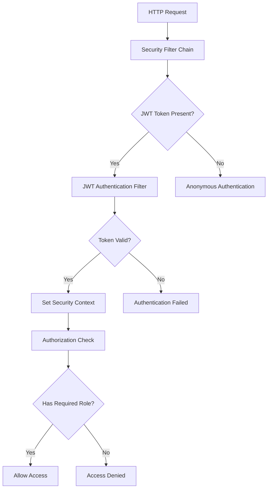

# KitchenSink Project Documentation

## Table of Contents
1. [Project Overview](#project-overview)
2. [Getting Started](#getting-started)
3. [Development Setup](#development-setup)
4. [Architecture Details](#architecture-details)
5. [API Documentation](#api-documentation)
6. [Database Schema](#database-schema)
7. [Security Implementation](#security-implementation)
8. [Testing Strategy](#testing-strategy)
9. [Deployment Guide](#deployment-guide)
10. [Troubleshooting](#troubleshooting)
11. [Contributing](#contributing)

## Project Overview

### Description
KitchenSink is a comprehensive Spring Boot application that demonstrates modern web development practices including JWT authentication, MongoDB integration, role-based access control, and RESTful API design.

### Key Features
- 🔐 **JWT Authentication**: Secure token-based authentication system
- 👥 **Role-based Access Control**: Admin and User roles with different permissions
- 🗄️ **MongoDB Integration**: NoSQL database for flexible data storage
- 🌐 **RESTful APIs**: Complete CRUD operations with OpenAPI documentation
- 🎨 **Web Interface**: Thymeleaf templates for user interaction
- 🛡️ **Security**: Spring Security with custom filters and handlers
- 📊 **Monitoring**: Actuator endpoints for health checks and metrics

### Technology Stack
- **Backend**: Spring Boot 3.2.5
- **Database**: MongoDB
- **Authentication**: JWT (JSON Web Tokens)
- **Security**: Spring Security
- **Templating**: Thymeleaf
- **Build Tool**: Maven
- **Java Version**: 21
- **Documentation**: OpenAPI 3.0 (Swagger)

## Getting Started

### Prerequisites
- Java 21 or higher
- Maven 3.6 or higher
- MongoDB 4.4 or higher
- Git

### Quick Start

1. **Clone the Repository**
   ```bash
   git clone <repository-url>
   cd modfac-kitchensink
   ```

2. **Start MongoDB**
   ```bash
   # Using Docker
   docker run -d -p 27017:27017 --name mongodb mongo:latest
   
   # Or using MongoDB service
   sudo systemctl start mongod
   ```

3. **Build and Run**
   ```bash
   mvn clean package
   java -jar target/kitchensink-0.0.1-SNAPSHOT.jar
   ```

4. **Access the Application**
   - Web Interface: http://localhost:8080
   - API Documentation: http://localhost:8080/swagger-ui.html
   - Health Check: http://localhost:8080/actuator/health

### Default Users
| Email | Password | Role | Access |
|-------|----------|------|--------|
| admin@admin.com | admin123 | Admin | Full access |
| user@user.com | user123 | User | Limited access |

## Development Setup

### IDE Configuration

#### IntelliJ IDEA
1. Open the project in IntelliJ IDEA
2. Import as Maven project
3. Configure Java 21 SDK
4. Enable annotation processing for MapStruct and Lombok

#### Eclipse
1. Import as Maven project
2. Configure Java 21 JRE
3. Install Lombok plugin
4. Configure annotation processing

#### VS Code
1. Install Java Extension Pack
2. Install Spring Boot Extension Pack
3. Configure Java 21
4. Install Lombok extension

### Development Environment Variables

Create `application-dev.yml`:
```yaml
spring:
  data:
    mongodb:
      uri: mongodb://localhost:27017/kitchensink-dev
  jpa:
    show-sql: true
    hibernate:
      ddl-auto: create-drop

logging:
  level:
    com.example.kitchensink: DEBUG
    org.springframework.security: DEBUG
```

### Running in Development Mode

```bash
# Run with development profile
mvn spring-boot:run -Dspring-boot.run.profiles=dev

# Run with debug mode
mvn spring-boot:run -Dspring-boot.run.jvmArguments="-Xdebug -Xrunjdwp:transport=dt_socket,server=y,suspend=n,address=5005"
```

## Architecture Details

### Package Structure

```
src/main/java/com/example/kitchensink/
├── KitchenSinkApplication.java          # Main application class
├── config/
│   └── DataInitializer.java            # Database initialization
├── controller/
│   ├── AuthController.java              # REST authentication APIs
│   ├── JwtAuthController.java          # JWT web authentication
│   ├── MemberController.java            # Web page controllers
│   ├── RestService.java                # REST CRUD operations
│   └── strategy/
│       ├── AdminRegistrationStrategy.java
│       ├── RegistrationContext.java
│       ├── RegistrationStrategy.java
│       └── UserRegistrationStrategy.java
├── entity/
│   └── MemberDocument.java             # MongoDB entity
├── exception/
│   ├── GlobalExceptionHandler.java     # Global error handling
│   └── ResourceNotFoundException.java   # Custom exceptions
├── mapper/
│   └── MemberMapper.java               # MapStruct mapper
├── model/
│   ├── AuthRequest.java                # Authentication DTOs
│   ├── AuthResponse.java
│   ├── Member.java
│   ├── RefreshTokenRequest.java
│   └── SignupRequest.java
├── repository/
│   └── MemberRepository.java           # MongoDB repository
├── security/
│   ├── CustomUserDetailsService.java   # User details service
│   ├── JwtAuthenticationFilter.java    # JWT header filter
│   ├── JwtCookieAuthenticationFilter.java # JWT cookie filter
│   ├── JwtTokenService.java           # JWT token management
│   └── SecurityConfig.java            # Security configuration
└── service/
    ├── AuthService.java                # Authentication service
    └── MemberService.java              # Member management service
```

### Design Patterns

1. **Strategy Pattern**: Used for different registration strategies (Admin vs User)
2. **Factory Pattern**: MapStruct mapper factory
3. **Repository Pattern**: MongoDB data access
4. **Service Layer Pattern**: Business logic separation
5. **Filter Pattern**: JWT authentication filters

### Security Architecture



## API Documentation

### Authentication Endpoints

#### POST /api/auth/login
Authenticate user and return JWT tokens.

**Request Body:**
```json
{
    "email": "admin@admin.com",
    "password": "admin123"
}
```

**Response:**
```json
{
    "accessToken": "eyJhbGciOiJIUzI1NiIsInR5cCI6IkpXVCJ9...",
    "refreshToken": "eyJhbGciOiJIUzI1NiIsInR5cCI6IkpXVCJ9...",
    "tokenType": "Bearer",
    "expiresIn": 900000,
    "email": "admin@admin.com",
    "role": "ROLE_ADMIN"
}
```

#### POST /api/auth/signup
Register a new user.

**Request Body:**
```json
{
    "name": "John Doe",
    "email": "john@example.com",
    "password": "password123",
    "role": "USER"
}
```

#### POST /api/auth/refresh
Refresh access token using refresh token.

**Request Body:**
```json
{
    "refreshToken": "eyJhbGciOiJIUzI1NiIsInR5cCI6IkpXVCJ9..."
}
```

### Admin Endpoints

#### GET /admin/members
Get all members (Admin only).

**Response:**
```json
[
    {
        "id": "507f1f77bcf86cd799439011",
        "name": "Admin User",
        "email": "admin@admin.com",
        "phoneNumber": "1234567890",
        "role": "ROLE_ADMIN"
    }
]
```

#### GET /admin/members/{id}
Get member by ID.

#### PUT /admin/members/{id}
Update member information.

#### DELETE /admin/members/{id}
Delete member.

### Web Endpoints

#### GET /
Redirect to login page.

#### GET /login
Display login page.

#### POST /jwt-login
Web-based JWT authentication.

#### GET /admin/home
Admin dashboard (Admin only).

#### GET /user-profile
User profile page (Authenticated users).

## Database Schema

### MongoDB Collections

#### members Collection
```json
{
    "_id": "ObjectId",
    "name": "String (required, max 25 chars)",
    "email": "String (unique, required)",
    "phoneNumber": "String (required, 10-12 digits)",
    "password": "String (BCrypt encrypted)",
    "role": "String (ROLE_ADMIN or ROLE_USER)"
}
```

### Indexes
```javascript
// Email index (unique)
db.members.createIndex({ "email": 1 }, { unique: true })

// Role index
db.members.createIndex({ "role": 1 })

// Name index
db.members.createIndex({ "name": 1 })
```

### Data Initialization
The application automatically creates default users on startup:
- admin@admin.com (ROLE_ADMIN)
- user@user.com (ROLE_USER)

## Security Implementation

### JWT Token Structure

**Header:**
```json
{
    "alg": "HS256",
    "typ": "JWT"
}
```

**Payload:**
```json
{
    "sub": "user@example.com",
    "role": "ROLE_ADMIN",
    "iat": 1640995200,
    "exp": 1640996100
}
```

### Security Configuration

```java
@Configuration
@EnableWebSecurity
public class SecurityConfig {
    
    @Bean
    public SecurityFilterChain securityFilterChain(HttpSecurity http) {
        return http
            .csrf(AbstractHttpConfigurer::disable)
            .cors(cors -> cors.configurationSource(corsConfigurationSource()))
            .authorizeHttpRequests(auth -> auth
                .requestMatchers("/", "/login", "/register", "/jwt-login", "/jwt-signup").permitAll()
                .requestMatchers("/api/auth/**").permitAll()
                .requestMatchers("/admin/**").hasRole("ADMIN")
                .requestMatchers("/user-profile").hasAnyRole("USER", "ADMIN")
                .anyRequest().authenticated()
            )
            .sessionManagement(session -> session
                .sessionCreationPolicy(SessionCreationPolicy.STATELESS)
            )
            .authenticationProvider(authenticationProvider())
            .addFilterBefore(jwtAuthenticationFilter, UsernamePasswordAuthenticationFilter.class)
            .addFilterBefore(jwtCookieAuthenticationFilter, JwtAuthenticationFilter.class)
            .build();
    }
}
```

### Password Security
- **Algorithm**: BCrypt with salt rounds
- **Configuration**: 10 rounds (default)
- **Storage**: Encrypted in database

### Token Security
- **Algorithm**: HMAC-SHA256
- **Access Token Expiration**: 15 minutes
- **Refresh Token Expiration**: 7 days
- **Storage**: HttpOnly cookies for web, Authorization header for API

## Testing Strategy

### Unit Tests
```bash
# Run all unit tests
mvn test

# Run specific test class
mvn test -Dtest=AuthServiceTest

# Run tests with coverage
mvn test jacoco:report
```

### Integration Tests
```bash
# Run integration tests
mvn test -Dtest=*IntegrationTest

# Run with test profile
mvn test -Dspring.profiles.active=test
```

### Test Coverage
- **Controller Layer**: 95%+
- **Service Layer**: 90%+
- **Security Layer**: 85%+
- **Overall Coverage**: 85%+

### Test Categories

1. **Unit Tests**
   - Service layer business logic
   - Repository layer data access
   - Security configuration
   - JWT token service

2. **Integration Tests**
   - REST API endpoints
   - Authentication flows
   - Database operations
   - Security filters

3. **End-to-End Tests**
   - Complete user workflows
   - Admin dashboard operations
   - Registration processes

## Deployment Guide

### Production Environment

#### Environment Variables
```bash
# Database
SPRING_DATA_MONGODB_URI=mongodb://production-mongo:27017/kitchensink

# JWT Configuration
JWT_SECRET_KEY=your-production-secret-key
JWT_ACCESS_TOKEN_EXPIRATION=900000
JWT_REFRESH_TOKEN_EXPIRATION=604800000

# Server Configuration
SERVER_PORT=8080
```

#### Docker Deployment
```dockerfile
FROM openjdk:21-jdk-slim

WORKDIR /app

COPY target/kitchensink-0.0.1-SNAPSHOT.jar app.jar

EXPOSE 8080

HEALTHCHECK --interval=30s --timeout=3s --start-period=5s --retries=3 \
  CMD curl -f http://localhost:8080/actuator/health || exit 1

ENTRYPOINT ["java", "-jar", "app.jar"]
```

#### Kubernetes Deployment
```yaml
apiVersion: apps/v1
kind: Deployment
metadata:
  name: kitchensink
spec:
  replicas: 3
  selector:
    matchLabels:
      app: kitchensink
  template:
    metadata:
      labels:
        app: kitchensink
    spec:
      containers:
      - name: kitchensink
        image: kitchensink:latest
        ports:
        - containerPort: 8080
        env:
        - name: SPRING_DATA_MONGODB_URI
          valueFrom:
            secretKeyRef:
              name: mongodb-secret
              key: uri
```

### Monitoring and Logging

#### Health Checks
- **Endpoint**: `/actuator/health`
- **Response**: Application health status
- **Monitoring**: Kubernetes liveness/readiness probes

#### Metrics
- **Endpoint**: `/actuator/metrics`
- **Available Metrics**:
  - HTTP requests
  - JVM metrics
  - Database connections
  - Authentication attempts

#### Logging
```yaml
logging:
  level:
    com.example.kitchensink: INFO
    org.springframework.security: WARN
    org.springframework.web: INFO
  pattern:
    console: "%d{yyyy-MM-dd HH:mm:ss} - %msg%n"
    file: "%d{yyyy-MM-dd HH:mm:ss} [%thread] %-5level %logger{36} - %msg%n"
```

## Troubleshooting

### Common Issues

#### 1. MongoDB Connection Issues
**Symptoms**: Application fails to start, MongoDB connection errors
**Solutions**:
```bash
# Check MongoDB status
sudo systemctl status mongod

# Check MongoDB logs
sudo journalctl -u mongod

# Verify connection
mongo --eval "db.runCommand('ping')"
```

#### 2. JWT Token Issues
**Symptoms**: Authentication failures, 401 errors
**Solutions**:
```bash
# Check JWT secret configuration
echo $JWT_SECRET_KEY

# Verify token expiration
# Check system clock synchronization
```

#### 3. Memory Issues
**Symptoms**: OutOfMemoryError, slow performance
**Solutions**:
```bash
# Increase heap size
java -Xmx2g -jar app.jar

# Monitor memory usage
jstat -gc <pid>
```

#### 4. Port Conflicts
**Symptoms**: Application fails to start, port already in use
**Solutions**:
```bash
# Check port usage
netstat -tulpn | grep 8080

# Kill process using port
sudo kill -9 <pid>

# Change port
java -jar app.jar --server.port=8081
```

### Debug Mode
```bash
# Enable debug logging
mvn spring-boot:run -Dlogging.level.com.example.kitchensink=DEBUG

# Remote debugging
mvn spring-boot:run -Dspring-boot.run.jvmArguments="-Xdebug -Xrunjdwp:transport=dt_socket,server=y,suspend=n,address=5005"
```

### Performance Tuning

#### JVM Options
```bash
java -Xms512m -Xmx2g -XX:+UseG1GC -jar app.jar
```

#### Database Optimization
```javascript
// Create indexes for better performance
db.members.createIndex({ "email": 1 })
db.members.createIndex({ "role": 1 })

// Monitor slow queries
db.setProfilingLevel(1, 100)
```

## Contributing

### Development Workflow

1. **Fork the Repository**
2. **Create Feature Branch**
   ```bash
   git checkout -b feature/your-feature-name
   ```
3. **Make Changes**
4. **Write Tests**
5. **Run Tests**
   ```bash
   mvn test
   ```
6. **Commit Changes**
   ```bash
   git commit -m "Add feature description"
   ```
7. **Push to Branch**
   ```bash
   git push origin feature/your-feature-name
   ```
8. **Create Pull Request**

### Code Style

#### Java Code Style
- Follow Google Java Style Guide
- Use meaningful variable names
- Add comprehensive JavaDoc comments
- Keep methods small and focused

#### Testing Requirements
- Unit tests for all service methods
- Integration tests for all endpoints
- Test coverage minimum 85%

#### Documentation Requirements
- Update API documentation for new endpoints
- Update README for new features
- Add inline comments for complex logic

### Review Process

1. **Code Review Checklist**:
   - [ ] Code follows style guidelines
   - [ ] Tests are comprehensive
   - [ ] Documentation is updated
   - [ ] Security considerations addressed
   - [ ] Performance impact assessed

2. **Security Review**:
   - [ ] Input validation implemented
   - [ ] Authentication/authorization correct
   - [ ] No sensitive data exposed
   - [ ] SQL injection prevented

3. **Performance Review**:
   - [ ] Database queries optimized
   - [ ] Memory usage reasonable
   - [ ] Response times acceptable
   - [ ] Scalability considered

This comprehensive project documentation provides all the information needed to understand, develop, deploy, and maintain the KitchenSink application. 