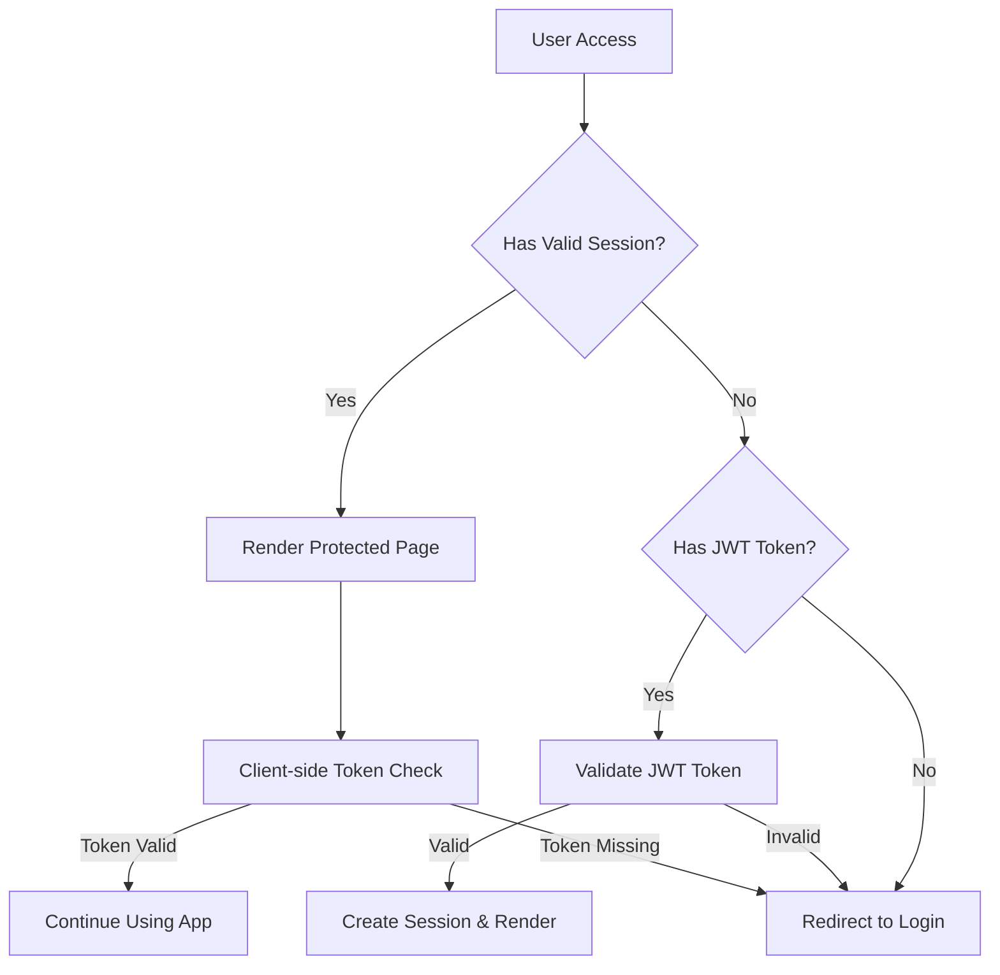
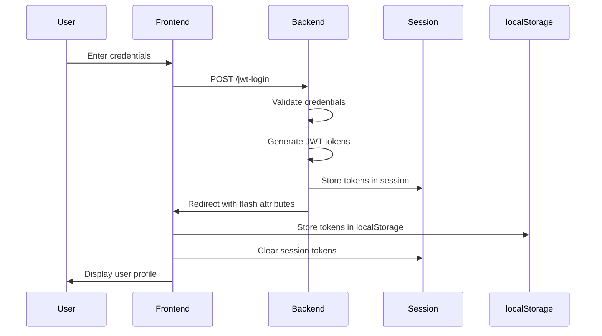
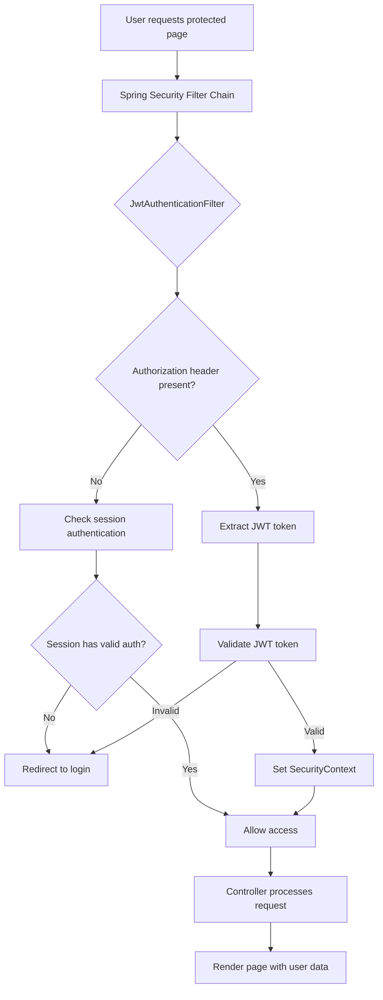
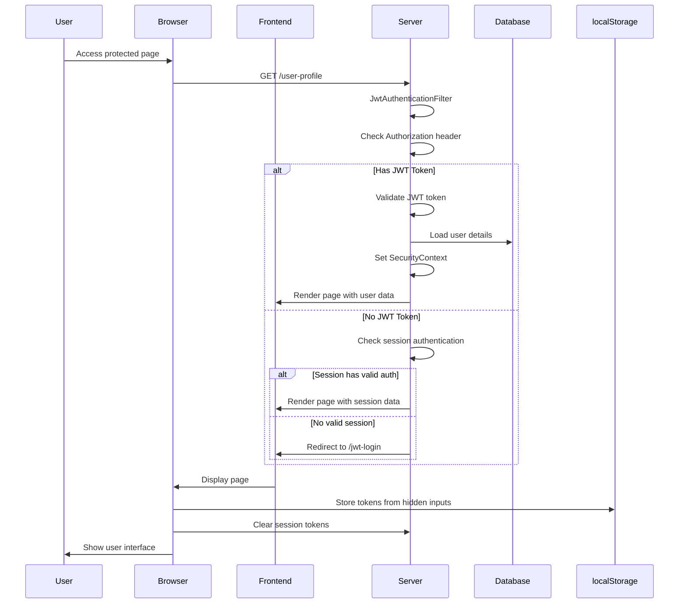
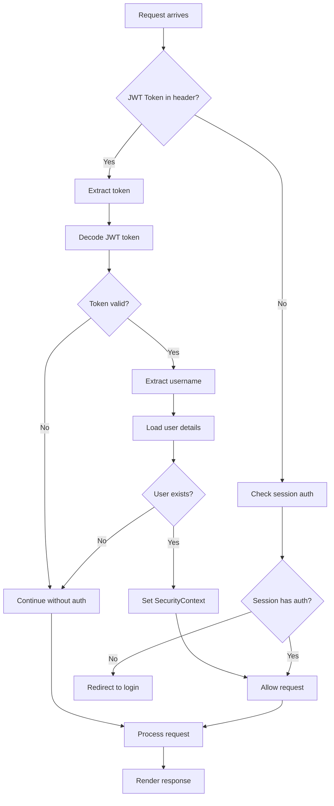
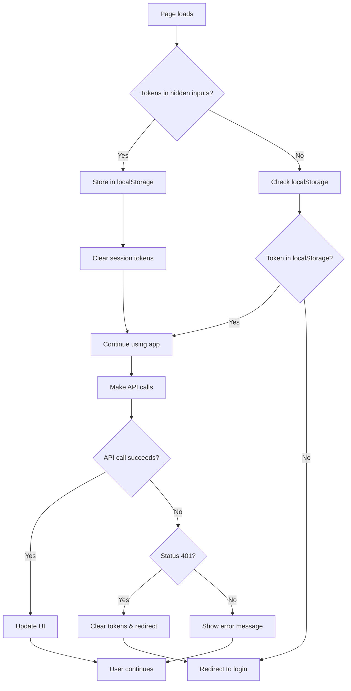

# UI Flow Documentation - KitchenSink Application

## Overview

This document provides a comprehensive breakdown of the user interface (UI) flow in the KitchenSink application, focusing on authentication, JWT token handling, and page rendering. The application uses a hybrid approach combining server-side session management with client-side JWT token storage.

## Table of Contents

1. [Authentication Flow Overview](#authentication-flow-overview)
2. [JWT Token Lifecycle](#jwt-token-lifecycle)
3. [Protected Page Access Flow](#protected-page-access-flow)
4. [Token Retrieval and Storage](#token-retrieval-and-storage)
5. [Token Verification Process](#token-verification-process)
6. [UI Rendering Based on Token Status](#ui-rendering-based-on-token-status)
7. [Error Handling and Redirects](#error-handling-and-redirects)
8. [Flow Diagrams](#flow-diagrams)

---

## Authentication Flow Overview

The KitchenSink application implements a **hybrid authentication system** that combines:

- **Server-side session management** for immediate authentication state
- **Client-side JWT token storage** for API calls and persistent authentication
- **Spring Security filters** for request-level authentication
- **Thymeleaf templates** for server-side rendering

### Key Components



---

## JWT Token Lifecycle

### 1. Token Generation (Login Process)



### 2. Token Storage Strategy

The application uses a **dual storage approach**:

#### Server-Side Storage (Session)
```java
// In JwtAuthController.java
session.setAttribute("accessToken", accessToken);
session.setAttribute("refreshToken", refreshToken);
session.setAttribute("userEmail", userDetails.getUsername());
session.setAttribute("userRole", role);
```

#### Client-Side Storage (localStorage)
```javascript
// In user-profile.html
localStorage.setItem('accessToken', accessToken);
localStorage.setItem('refreshToken', refreshToken);
localStorage.setItem('userEmail', userEmail);
localStorage.setItem('userRole', userRole);
```

---

## Protected Page Access Flow

### Step-by-Step Breakdown

#### 1. Initial Request Processing



#### 2. Detailed Flow Explanation

**Step 1: Request Interception**
```java
// JwtAuthenticationFilter.java
final String authHeader = request.getHeader("Authorization");
if (authHeader == null || !authHeader.startsWith("Bearer ")) {
    filterChain.doFilter(request, response);
    return;
}
```

**Step 2: Token Extraction**
```java
final String jwt = authHeader.substring(7);
final String username = jwtTokenService.extractUsername(jwt);
```

**Step 3: User Details Loading**
```java
UserDetails userDetails = this.userDetailsService.loadUserByUsername(username);
```

**Step 4: Token Validation**
```java
if (jwtTokenService.isTokenValid(jwt)) {
    UsernamePasswordAuthenticationToken authToken = new UsernamePasswordAuthenticationToken(
        userDetails, null, userDetails.getAuthorities()
    );
    SecurityContextHolder.getContext().setAuthentication(authToken);
}
```

---

## Token Retrieval and Storage

### 1. Server-Side Token Retrieval

#### From Session Attributes
```java
// In MemberController.java
String accessToken = (String) session.getAttribute("accessToken");
String refreshToken = (String) session.getAttribute("refreshToken");
String sessionUserEmail = (String) session.getAttribute("userEmail");
String sessionUserRole = (String) session.getAttribute("userRole");
```

#### From Flash Attributes (Login Redirect)
```java
// Check flash attributes first, then fall back to session
if (model.containsAttribute("accessToken")) {
    accessToken = (String) model.getAttribute("accessToken");
    refreshToken = (String) model.getAttribute("refreshToken");
    userEmail = (String) model.getAttribute("userEmail");
    userRole = (String) model.getAttribute("userRole");
}
```

### 2. Client-Side Token Retrieval

#### From localStorage
```javascript
// In script.js
function getAuthToken() {
    const token = localStorage.getItem('accessToken');
    return token;
}

function getAuthHeaders() {
    const token = getAuthToken();
    const headers = {
        'Content-Type': 'application/json',
        ...(token && { 'Authorization': `Bearer ${token}` })
    };
    return headers;
}
```

#### From Hidden Input Fields
```html
<!-- In user-profile.html -->
<input type="hidden" id="sessionAccessToken" th:value="${sessionAccessToken}" />
<input type="hidden" id="sessionRefreshToken" th:value="${sessionRefreshToken}" />
<input type="hidden" id="sessionUserEmail" th:value="${sessionUserEmail}" />
<input type="hidden" id="sessionUserRole" th:value="${sessionUserRole}" />
```

---

## Token Verification Process

### 1. Backend Token Verification

#### JWT Token Service
```java
// JwtTokenService.java
public boolean isTokenValid(String token) {
    try {
        return !isTokenExpired(token);
    } catch (Exception e) {
        return false;
    }
}

public String extractUsername(String token) {
    return extractClaim(token, Claims::getSubject);
}
```

#### Filter-Level Verification
```java
// JwtAuthenticationFilter.java
if (username != null && SecurityContextHolder.getContext().getAuthentication() == null) {
    UserDetails userDetails = this.userDetailsService.loadUserByUsername(username);
    
    if (jwtTokenService.isTokenValid(jwt)) {
        // Set authentication in SecurityContext
        UsernamePasswordAuthenticationToken authToken = new UsernamePasswordAuthenticationToken(
            userDetails, null, userDetails.getAuthorities()
        );
        SecurityContextHolder.getContext().setAuthentication(authToken);
    }
}
```

### 2. Client-Side Token Verification

#### Token Presence Check
```javascript
// In user-profile.html
const storedToken = localStorage.getItem('accessToken');
if (!storedToken) {
    window.location.href = '/jwt-login';
    return;
}
```

#### API Call Authentication
```javascript
// In script.js
fetch(url, {
    method: 'PUT',
    headers: getAuthHeaders(),
    body: JSON.stringify(updatedMember)
})
.then(response => {
    if (response.status === 401) {
        // Token expired or invalid
        localStorage.clear();
        window.location.href = '/jwt-login';
    }
});
```

---

## UI Rendering Based on Token Status

### 1. Server-Side Rendering Logic

#### User Profile Page Logic
```java
// MemberController.java - showUserProfile()
Member memberToDisplay = null;

// Priority 1: Use session data first (most reliable for current session)
if (sessionUserEmail != null) {
    MemberDocument memberDocument = memberService.findByEmail(sessionUserEmail).orElse(null);
    if (memberDocument != null) {
        memberToDisplay = memberMapper.memberEntityToMember(memberDocument);
    } else {
        // Create member from session data if not found in database
        memberToDisplay = new Member();
        memberToDisplay.setName(sessionUserEmail.split("@")[0]);
        memberToDisplay.setEmail(sessionUserEmail);
        memberToDisplay.setRole(sessionUserRole != null ? sessionUserRole : "ROLE_USER");
    }
}

// Priority 2: Use authenticated user information if no session data
if (memberToDisplay == null && authentication != null && authentication.isAuthenticated()) {
    // ... authentication-based logic
}

// Priority 3: Create default member if no session or authentication data
if (memberToDisplay == null) {
    memberToDisplay = new Member();
    memberToDisplay.setName("User");
    memberToDisplay.setEmail("user@example.com");
    memberToDisplay.setRole("ROLE_USER");
}
```

### 2. Client-Side Rendering Logic

#### Token-Based UI Updates
```javascript
// In user-profile.html
document.addEventListener('DOMContentLoaded', function() {
    const accessToken = document.getElementById('sessionAccessToken')?.value || null;
    const refreshToken = document.getElementById('sessionRefreshToken')?.value || null;
    
    if (accessToken && refreshToken) {
        // Store tokens in localStorage
        localStorage.setItem('accessToken', accessToken);
        localStorage.setItem('refreshToken', refreshToken);
        
        // Clear session attributes after storing in localStorage
        fetch('/user-profile?clearSession=true', { method: 'GET' });
    }
    
    // Check if user is authenticated
    const storedToken = localStorage.getItem('accessToken');
    if (!storedToken) {
        window.location.href = '/jwt-login';
        return;
    }
});
```

#### Conditional UI Elements
```html
<!-- In index.html - Admin-only features -->
<div th:if="${sessionUserRole == 'ROLE_ADMIN'}" class="admin-section">
    <h2>Admin Dashboard</h2>
    <!-- Admin-specific content -->
</div>

<!-- User-specific features -->
<div th:if="${sessionUserRole == 'ROLE_USER'}" class="user-section">
    <h2>User Dashboard</h2>
    <!-- User-specific content -->
</div>
```

---

## Error Handling and Redirects

### 1. Authentication Failures

#### 401 Unauthorized
```java
// SecurityConfig.java
@Bean
public AuthenticationEntryPoint authenticationEntryPoint() {
    return (request, response, authException) -> {
        log.warn("Authentication failed for request: {}", request.getRequestURI());
        response.sendRedirect("/401");
    };
}
```

#### 403 Forbidden
```java
// SecurityConfig.java
@Bean
public AccessDeniedHandler accessDeniedHandler() {
    return (request, response, accessDeniedException) -> {
        log.warn("Access denied for user: {}", 
            request.getUserPrincipal() != null ? 
            request.getUserPrincipal().getName() : "anonymous");
        response.sendRedirect("/403");
    };
}
```

### 2. Client-Side Error Handling

#### Token Expiration
```javascript
// In script.js
.then(response => {
    if (response.status === 401) {
        showModal('Session Expired', 'Your session has expired. Please login again.', 'error');
        localStorage.clear();
        window.location.href = '/jwt-login';
    } else if (response.status === 403) {
        showModal('Access Denied', 'You do not have permission to perform this action.', 'error');
    }
})
```

#### Network Errors
```javascript
.catch(error => {
    console.error('Error:', error);
    showModal('Network Error', 'Failed to connect to server. Please try again.', 'error');
});
```

---

## Flow Diagrams

### Complete Authentication Flow



### Token Validation Flow



### Client-Side Token Management



---

## Security Considerations

### 1. Token Security
- **JWT tokens** are stored in localStorage (client-side)
- **Session tokens** are stored server-side for immediate validation
- **Token expiration** is handled both client and server-side
- **HTTPS** should be used in production for secure transmission

### 2. Session Management
- **Session creation policy**: `IF_REQUIRED` (only when needed)
- **Session timeout**: Configured at application level
- **Session invalidation**: On logout and token expiration

### 3. Access Control
- **Role-based access**: Different UI elements for different roles
- **Method-level security**: `@PreAuthorize` annotations
- **URL-level security**: Configured in SecurityConfig

---

## Best Practices

### 1. Token Handling
- Always validate tokens on both client and server
- Implement proper error handling for expired tokens
- Use secure storage mechanisms (localStorage for this app)
- Clear tokens on logout and session expiration

### 2. UI State Management
- Prioritize session data over database lookups for current user
- Implement graceful degradation when tokens are missing
- Provide clear feedback for authentication errors
- Maintain consistent user experience across page refreshes

### 3. Error Handling
- Implement comprehensive error handling for all authentication scenarios
- Provide user-friendly error messages
- Log security events for monitoring
- Redirect users appropriately based on error type

---

## Conclusion

The KitchenSink application implements a robust authentication system that combines server-side session management with client-side JWT token storage. This hybrid approach provides:

- **Immediate authentication state** through server sessions
- **Persistent authentication** through JWT tokens
- **Secure API access** with proper token validation
- **Graceful error handling** for various authentication scenarios
- **Role-based UI rendering** based on user permissions

The flow ensures that users have a seamless experience while maintaining security standards appropriate for a production application. 